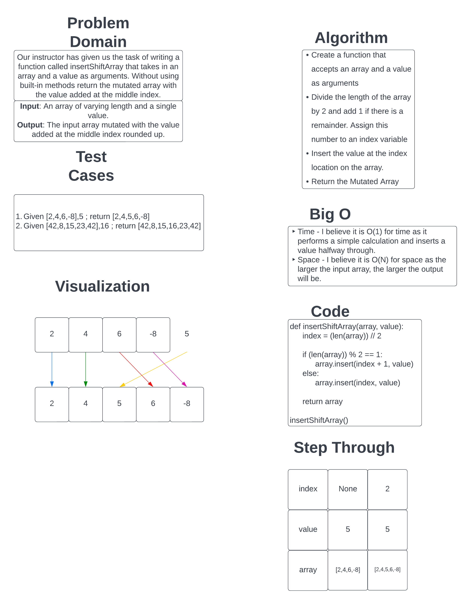

# Insert to Middle of an Array

Our task is to whiteboard out the task of inserting a value to he middle of an array, rounding up by defining the input and output of the function, what test cases to work with, a visualization of the algorithm to use, and the code to execute it.

## Whiteboard Process

## Approach & Efficiency

I took the approach of dividing the length of the array by 2 and using that value as the index number. If there was a remainder for the division, I would increment the index by one to simulate rounding up. Then I would use the .insert method to insert the value at the index number gotten from the division. Finally, I would return the mutated array.
I believe the Big O for this approach is O(1) for the time as it does the same calculation for any length array and will always return a number if the input is an array. As for space, I believe it is O(N) because the space will increase based on the size of the input array as the function just returns the original array mutated by adding the value in the middle.
