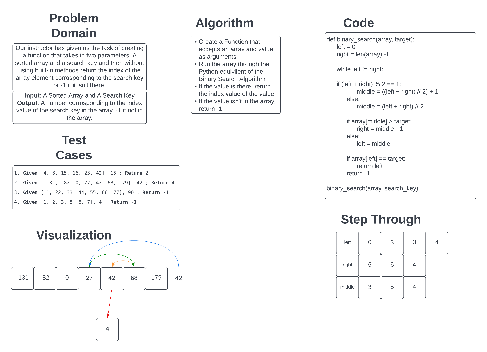

# Binary Search of Sorted Array

Our task is to whiteboard out the process of using a binary search on a sorted array using a target value and return the index value of the value in the array if it's there and -1 if it isn't. The whiteboard will consist of what test cases to work with, a visualization of the algorithm to use, and the code to execute it.

## Whiteboard Process

## Approach & Efficiency

I took the approach of adapting the alternate procedure for the [binary search algorithm](https://en.wikipedia.org/wiki/Binary_search_algorithm) and making it clearer and work with the input we are given.

As for the Big O for this approach, if I'm not wrong then I believe that this is logarithmic in nature and thus it will be O(log n) for the Big O.
