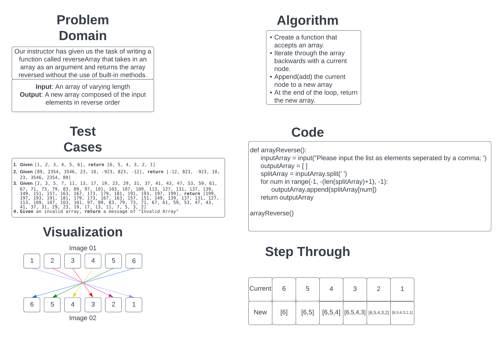

# Reverse an Array

Our task is to whiteboard out the task of reversing an array by defining the input and output of the function, what test cases to work with and a visualization of how the algorithm or function works.

## Whiteboard Process

## Approach & Efficiency

I took the approach of looping through the array and appending the value to a new array and then returning the new array. I chose to do it this way because I know how to code this algorithm and the alternative to this is one where I mutate the array but I don't know to code to demonstrate. I believe that the Big O for this approach is O(N) because the longer the array it has to work through, the more elements it will have to go through in the array to reach the end and thus it grows linearly with the size of the data set.
