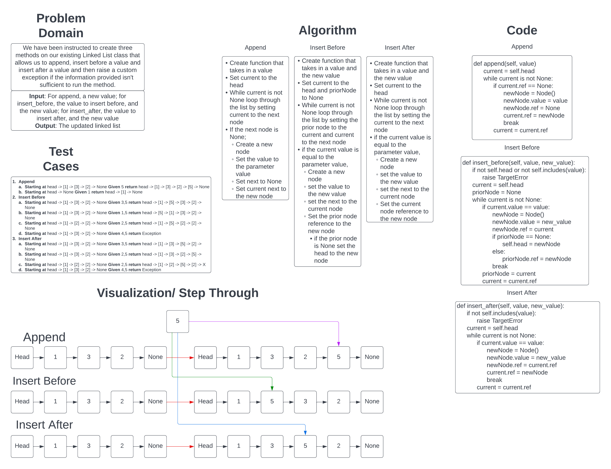

# Singly Linked List

Our task to to write out the code for a linked list and ensure it has the features necessary to pass the series of tests provided to us.

[Link to Code](../linked_list.py)

## Challenge

---

 By the end the code must be able to create a linked list, add one or more nodes to it, identify the head node, find a value within the list returning NULL if not there and return the full linked list in a required format.

Day 02: It must also be able to append a node to the end of the list, insert before a specifyied node and insert after a specified node.

## Approach & Efficiency

---

The approach for a linked list is by using a Class for the list and another for the Nodes, and setting methods and attributes for the different parts.

The Big O for this assignment is O(n) for the includes method, and printing out the full list and O(1) for adding new nodes as I am adding the node as the new Head node.

Day 02: The Big O for all three added methods are O(n) as all of them will be longer and larger as the input size increases.

