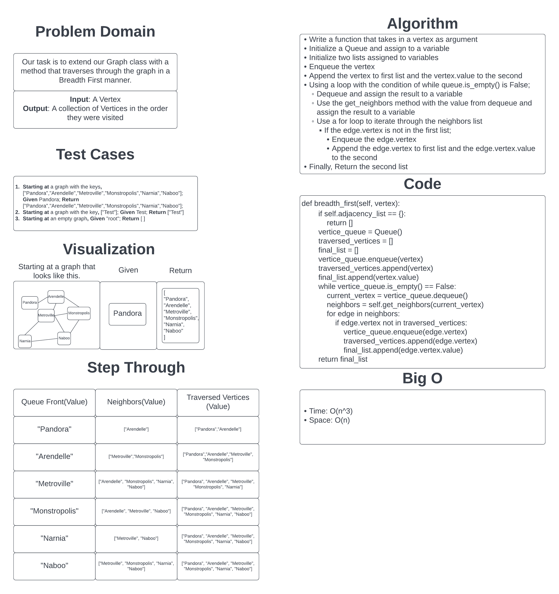

# Challenge Summary

Our task is to extend our implementation of our Graph with a method that traverses through the graph in a Breadth First approach. The method would take in a vertex and return a collection of the nodes in the order they were visited.

## Whiteboard Process

## Approach & Efficiency

I took the approach of using a queue and a list to keep track of the vertices as I traversed through the graph. It follows the process of adding the initial vertex to both the Queue and List, then using a while loop, Executes a dequeue, gets all the neighbors of that vertex, and using a for loop, if the current edge vertex is not in the visited vertices list, enqueues the neighbor vertex and adds it to the list of visited vertices. Finally, after the while loop ends, it returns a list of all the vertex values in the order they were visited.

Time: It is my belief that my implementation is technically O(n^3) because it has a while loop of O(n), but also a nested for loop that raises it to O(n^2) and then has a conditional that iterates through a list and raises the Big O to O(n*3). I believe that either I misunderstand the Big O of this approach or there is a far better way to solve this problem.
Space: O(n) because it has a Queue and Two lists that it adds to as the function loops and would thus increase in size as the size of the input does.

Overall, I think that there is definitely room for improvement, especially in the time complexity, and I do plan to come back to this later and find a better way to do this. Probably try and replace the visited vertices with a set to reduce down to O(n^2).

[Link to Code](../../data_structures/graph.py)
