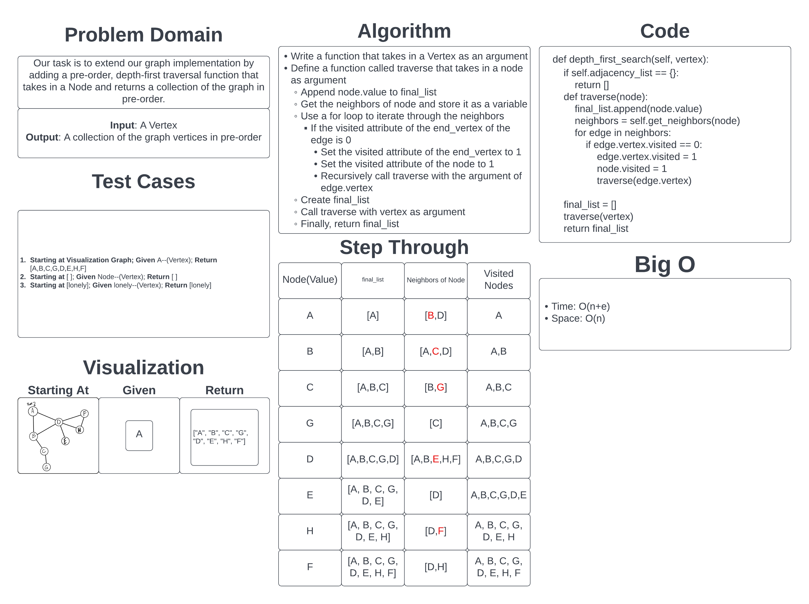

# Depth First Traversal

[Link to Code](../../data_structures/graph.py)

## Challenge

The challenge for today was to extend the implementation of our graph.py with a function that performs a pre-order depth-first traversal that returns the vertices in the correct order with the input being a vertex.

## Approach & Efficiency

I took the approach of finding the recursive solution to the problem making the code cleaner. Because of this, I did need to modify my Vertex class to have an additional attribute that allows for easier tracking of what vertices have already been visited.

- Time: O(n+e)
  - This is because it has to recurse through the entire graph once, and the `e` is for all the edges in the graph.
- Space: O(n)
  - This is because it creates and returns a list of all the vertices in the graph and would this be O(n)

## Solution

