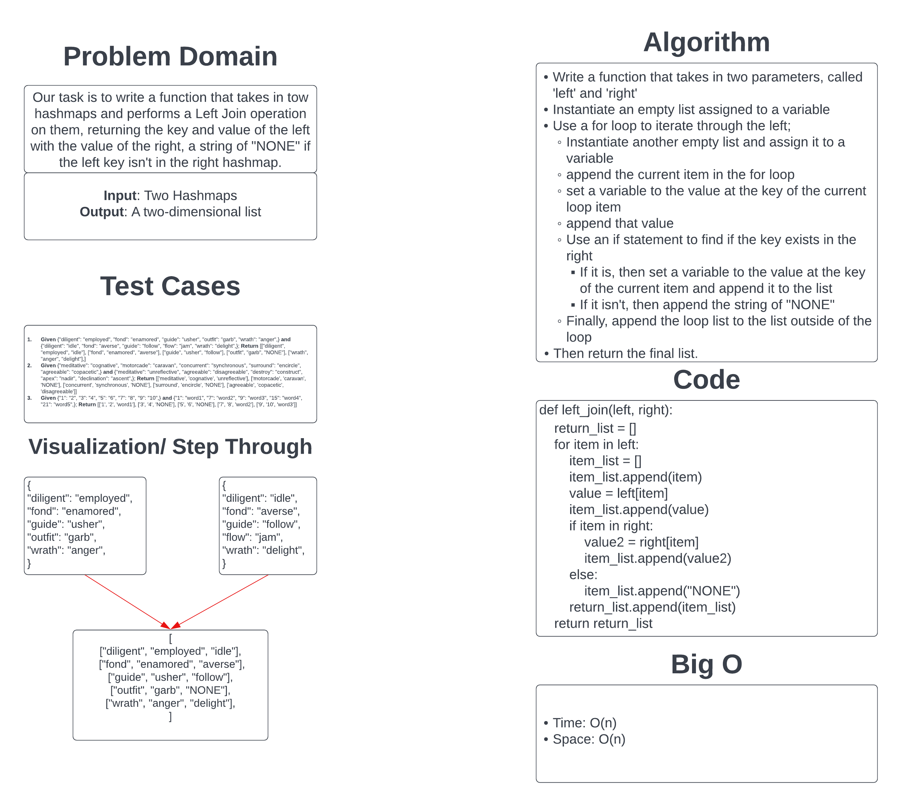

# Challenge Summary

Our task is to write a function that executes a Left Join on two hashmaps and returns a single data structure.

In this context, the tests provide two dictionaries and it adds a list of the key and value from the 'left' dictionary and the value from the 'right' if it exists. If it doesn't, then it adds a string of "NONE".

## Whiteboard Process

## Approach & Efficiency

I took the approach of using a for loop to add the left values than a conditional to attempt to find the key in the right. Due to this approach I believe it would be O(n) for time.
As for space, I use two lists that get populated as the function runs and thus I believe that the space would be O(n) as well.

[Link to Code](../../code_challenges/hashtable_left_join.py)
