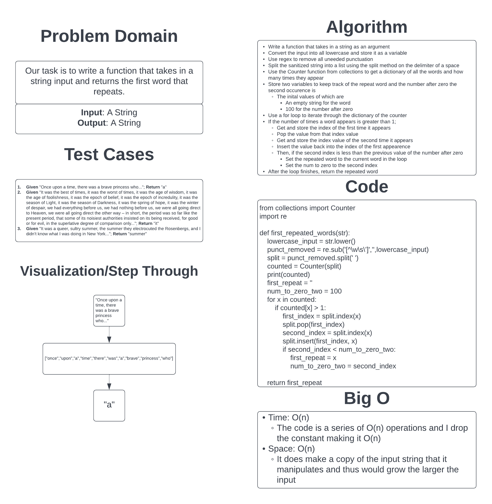

# Challenge Summary

Our task is to write out a function that takes in a string and returns the word that repeats first within it. I'm pretty sure I'm pushing the limits of what could be acceptable for the solution to this problem, but it does work.

## Whiteboard Process

## Approach & Efficiency

I took the approach of working step by step in the literal way a computer would and take as much information and previous experience to create a solution to the problem. The solution essentially sanitizes the input, makes the string into a list and then counts up how many time each word appears in the list and then through some conditionals it decides which word repeated first.

I believe that this approach would be O(n) for both time and space as it is series of O(n) operations and with a dropped constant is O(n) for time and it does essentially copy and manipulate the input within the function so the space would grow with the size of the input.

[Link to Code](../../code_challenges/hashtable_repeated_word.py)
