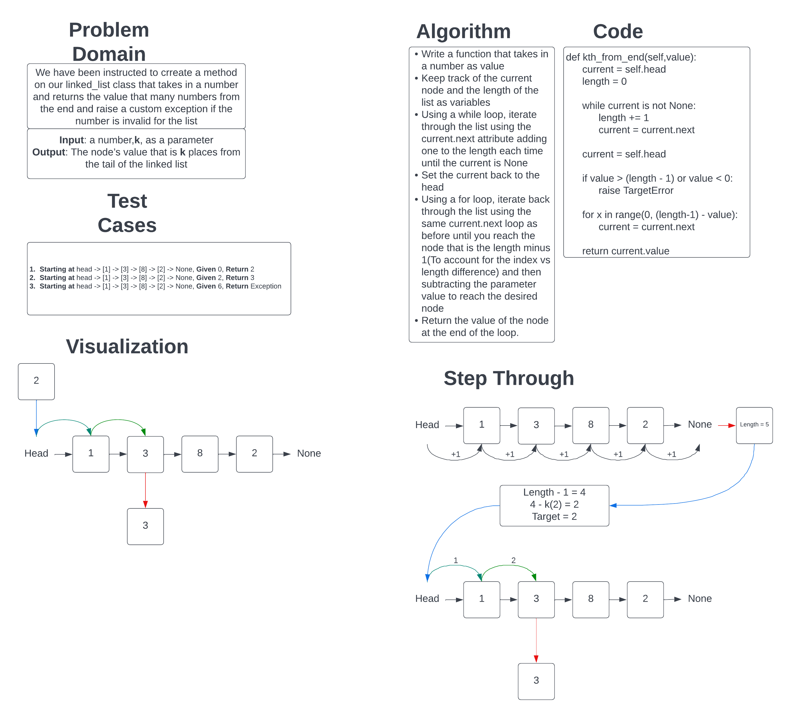

# Singly Linked List Kth

Our challenge was to add an additional method to our Linked List class that accepts a number for a parameter and returns the node value that many from the end of the linked list

## Whiteboard Process

## Approach & Efficiency

I believe that the approach I took is O(n) for time as the method still traverses through the entire list to get the length and so the time will increase as the list length does. As for space, the output would be O(1) because it will always return a single value, but the algorithm has a variable for length that it calculates manually so it could be O(n) for space too because it does this.

[Link to The Code](../../data_structures/linked_list.py)
