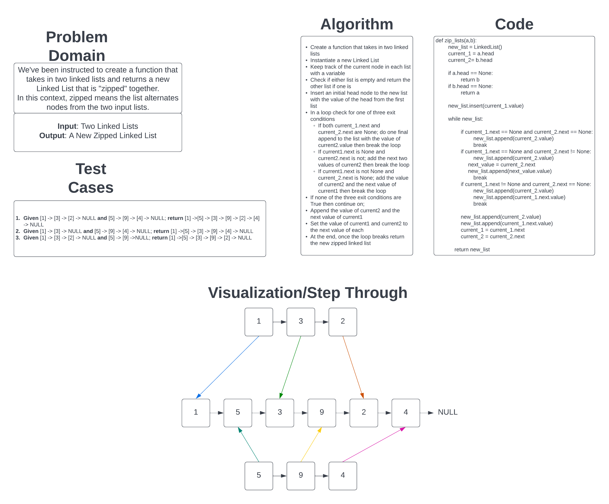

# Challenge Summary

Our challenge was to write a function that took in two linked lists and return a new "zipped" linked list with "zipped" in this context meaning that each node alternated between the two list.

## Whiteboard Process

## Approach & Efficiency

I took the approach of iterating through each list in a loop until one or both of the next references in the list was `None`.

- Because of this, the Big O for time would be O(n) due to the algorithm taking longer the larger the input linked lists are.
- As for space, I believe it is O(1) because it is pointing to the same values as the two input linked lists and not adding anything new to the Linked List, and each variable I use will always point to just one value on each input list.

[Link to Code](../../code_challenges/linked_list_zip.py)
