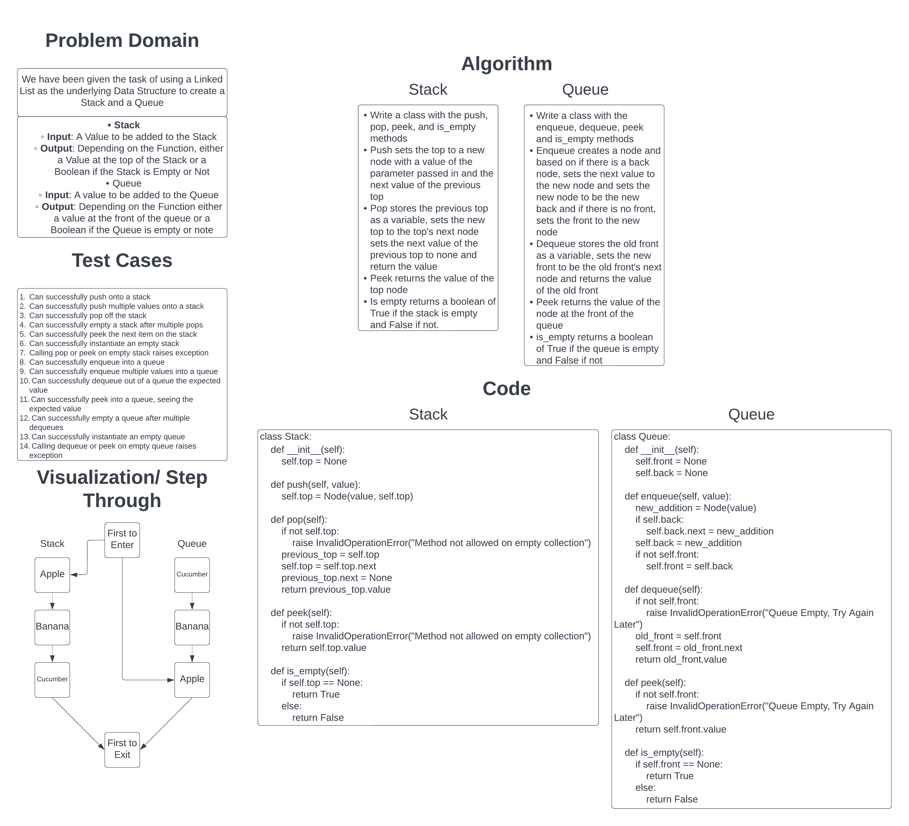

# Stacks and Queues

Stacks and Queues can be thought of as stripped down versions of a Linked List. They are often limited to 4 methods to interact with them. And while the names are different, the function is the same.
Push/Enqueue is for adding items; Pop/Dequeue is for removing items; Peek is for seeing the value of the first node; IsEmpty returns a boolean value dependent on if the Stack/Queue is empty or not.

## Challenge

Our challenge was to create a Stack and Queue using a Linked List as the underlying Data Structure.

## Whiteboard Process

## Approach & Efficiency

All 4 methods for both Stacks and Queues are O(1) in both time and space as they only ever interact with one node at a time no matter the length of either and only take in one value at a time.
