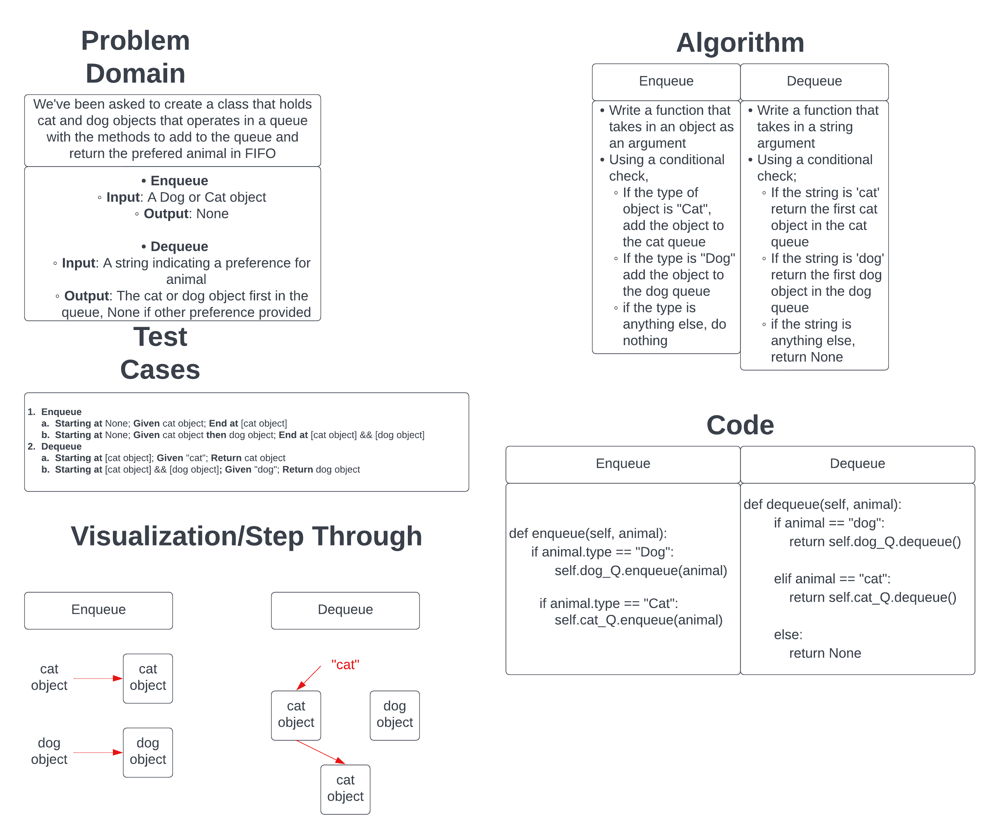

# Challenge Summary

Our task was to create an AnimalShelter class and implement a queue to store and manage cat and dog objects. The two methods to implement are `enqueue` which takes in an object argument and uses conditonal logic to determine whether to add the object into the cat queue or dog queue; and `dequeue` which takes in an argument to indicate the preference for whether they want a cat object, a dog object, or any other string. If the preference is 'cat' then it returns the first cat object in the queue and if the preference is 'dog' then it returns the first dog object in the queue.

## Whiteboard Process

## Approach & Efficiency

I took the approach of having two different queues, one for the dogs and one for the cats. As for the Big O for the code; Because it uses the methods from the Queue built in a previous code challenge and donesn't do anything else, I believe it would inherit the Big O from the Queue methods, all of which are O(1) for time and space.

[Link to Code](../../code_challenges/stack_queue_animal_shelter.py)
