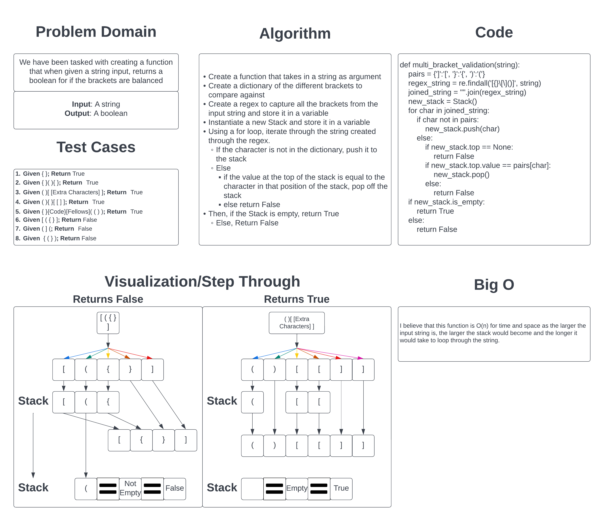

# Challenge Summary

We have been tasked with creating a function that validates if the brackets within a string input are balanced. Balanced in this context means that each opening bracket has a closing bracket "next" to it. The brackets can be nested or have other characters between them, but they have be "next" to each other and every opening has to have a closing.

## Whiteboard Process

## Approach & Efficiency

I took the approach of using a for loop to iterate through the string and add values to a Stack. Because of this, I believe that it would be O(n) for time and space as the stack would grow in size as the input string does and the larger the input sting, the more loops it would have to go through before it finished.

[Link to Code](../../code_challenges/stack_queue_brackets.py)
