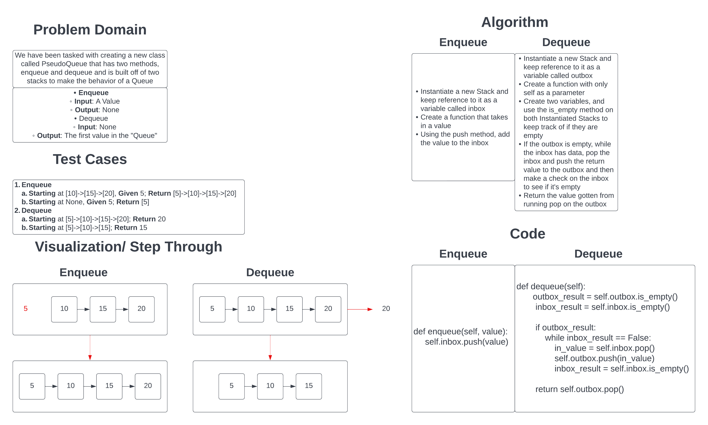

# Challenge Summary

Our task was to create a new Class that makes a queue using the basis of two Stacks. Within this PseudoQueue class, we needed to create two methods, `enqueue` and `dequeue` to add and remove values from the queue.

## Whiteboard Process

## Approach & Efficiency

For this challenge I tried to take the simplest approah I could. I started off by creating two Stacks with the names of inbox and outbox.

Then;

- For the `enqueue` method, I took the simplest approach by just pushing the value to the inbox stack. This is O(1) for both time and space as it just takes in a value and adds it to a stack.
- For the `dequeue` method, I took the approach of reducing the number of operation necessary to account for different orders of the methods being called by making the code only add values to the outbox if the outbox is empty. This operation is ideally O(1) for time and space, but for worst case senario, it is O(n) for Time as it processes through the inbox Stack to add values into the outbox. It remains O(1) for Space though as all the variables within the method will be the same regardless of the Stack size.

[Link to the Code](../../code_challenges/stack_queue_pseudo.py)
