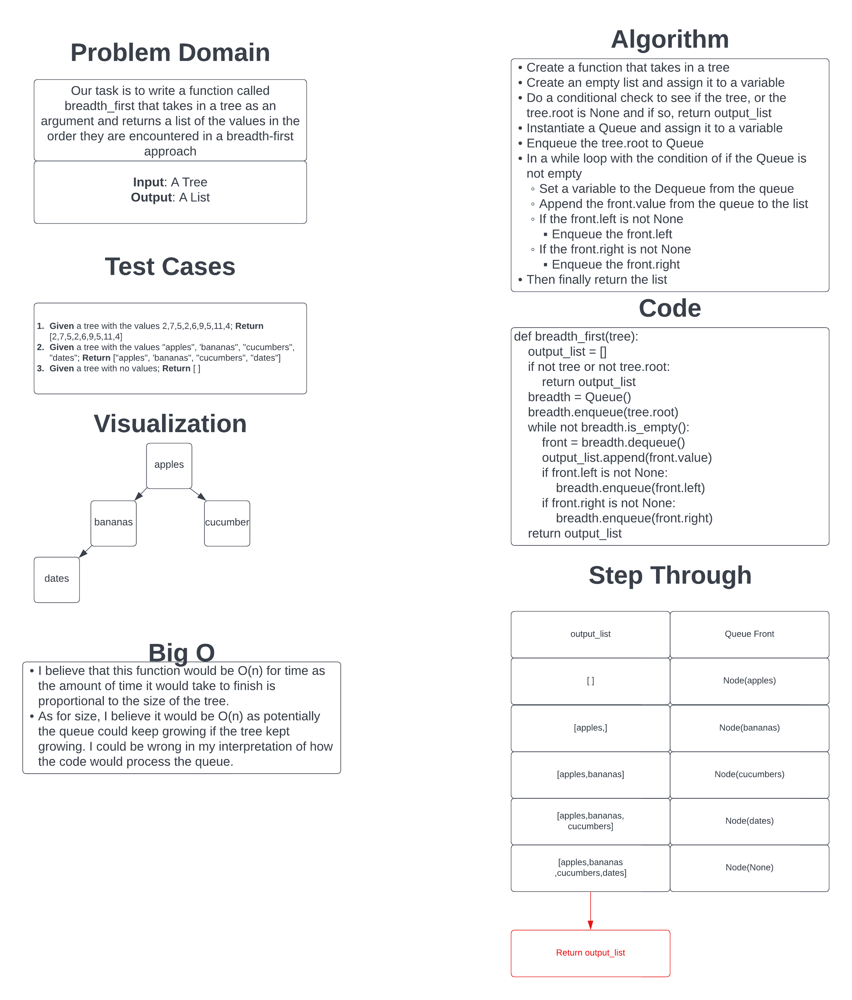

# Challenge Summary

Our task was to write out a function to when given a tree returns a list of values contained within the list in the order they are encountered when going through the tree with a breadth-first approach.

## Whiteboard Process

## Approach & Efficiency

I took the approach of adding the values to a list and adding each value to a queue that it processes through.
This approach is O(n) for time as the larger the tree, the longer it will take to loop through and process it.
It is also O(n) for space as the larger the tree, the larger the end state for the output_list would be and the larger the queue could theoretically grow if the tree is balanced.

[Link to Code](../../code_challenges/tree_breadth_first.py)
