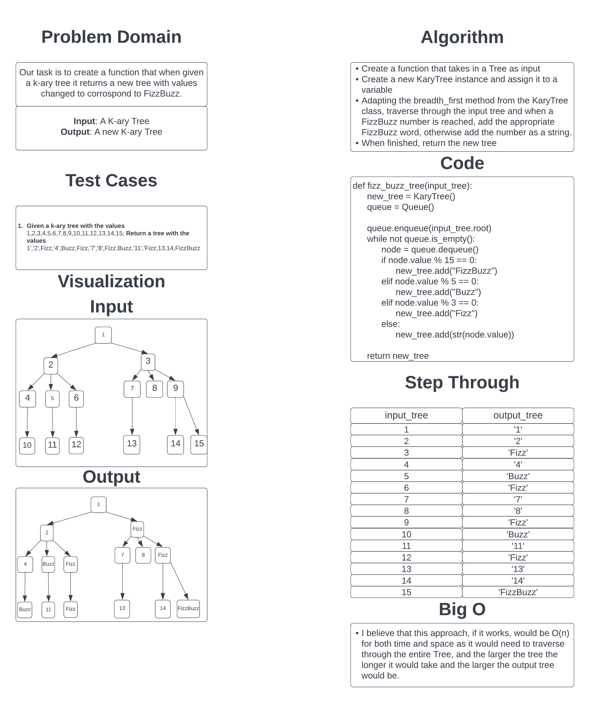

# Challenge Summary

Our task is to whiteboard out the process of taking in an K-ary Tree and returning a new K-ary tree that has an identical structure and has the appropriate values replaced with their FizzBuzz equivalents(Every multiple of 3 is "Fizz", Every multiple of 5 is "Buzz", and every multiple of both 3 and 5 is "FizzBuzz").

## Whiteboard Process

## Approach & Efficiency

I took the approach of adapting the breadth_first method from the KaryTree Class to go through the input tree in a Breadth-First traversal and add each value to a new KaryTree instance but each value is checked against a set of Conditional Checks to see if they are a FizzBuzz number and if they are, instead of the value stringified being added to the new tree, the string for the appropriate FizzBuzz word is added.

I believe that this approach would be O(n) for time and space because it has to traverse through the entire input tree and the time to traverse it and the space of the new tree would grow in proportion to the input tree.
