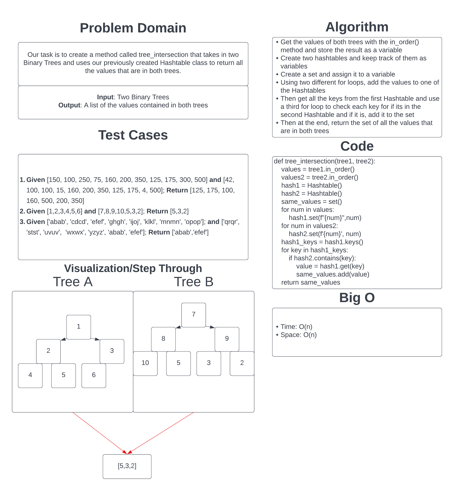

# Challenge Summary

For this challenge we were tasked with creating a function that takes in two binary trees and returns a set of all the values that are in both trees. Part of the assignment is to use the previously created Hashtable class.

## Whiteboard Process

## Approach & Efficiency

For this approach, I used the Hashtable literally, and it makes it more inefficient than I would ideally want, but it doesn't change the overall Big O, just the dropped constant.

- Time: O(n)
  - The code uses a few for loops to manipulate the data and then at the end returns a set of the values. Overall, the Big O with dropped constants would be O(n)
- Space: O(n)
  - Within the function, it has several areas that grow in size proportionate to the input size. Overall, with dropped constants, it would O(n)

[Link to the Code](../../code_challenges/tree_intersection.py)
