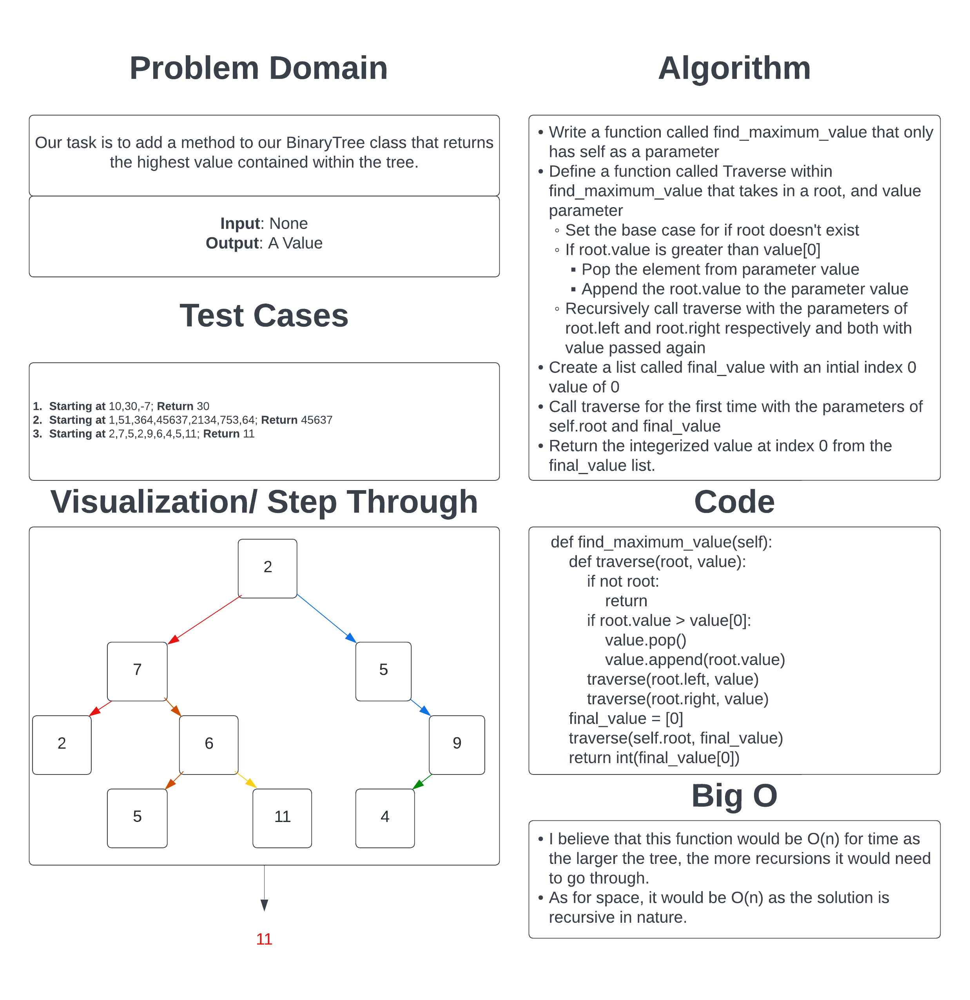

# Challenge Summary

Our task is to add a method to our existing BinaryTree class that returns the highest(max) value contained within the tree. The method takes in no input beyond the self and returns the numerical value of the highest value within the tree.

## Whiteboard Process

## Approach & Efficiency

I took the approach of adapting the traverse function from the previous BinaryTree methods. It continually replaces the 0th index value in a list whenever a higher value is found and then when it has recursed through the whole tree, it returns the value.
This approach is O(n) for both time and space because it is recursive in nature and will take longer to perform the task the larger the tree is and the more recursions it needs to go through, the larger the call stack will become.

[Link to Code](../../data_structures/binary_tree.py)
