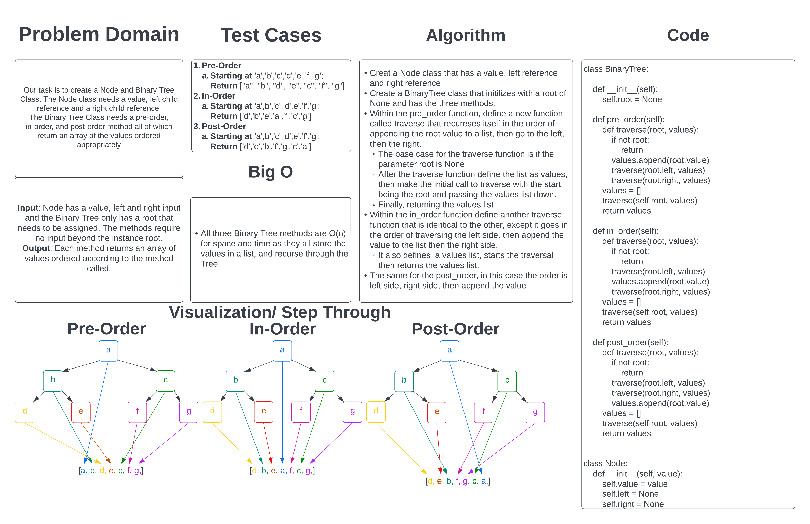
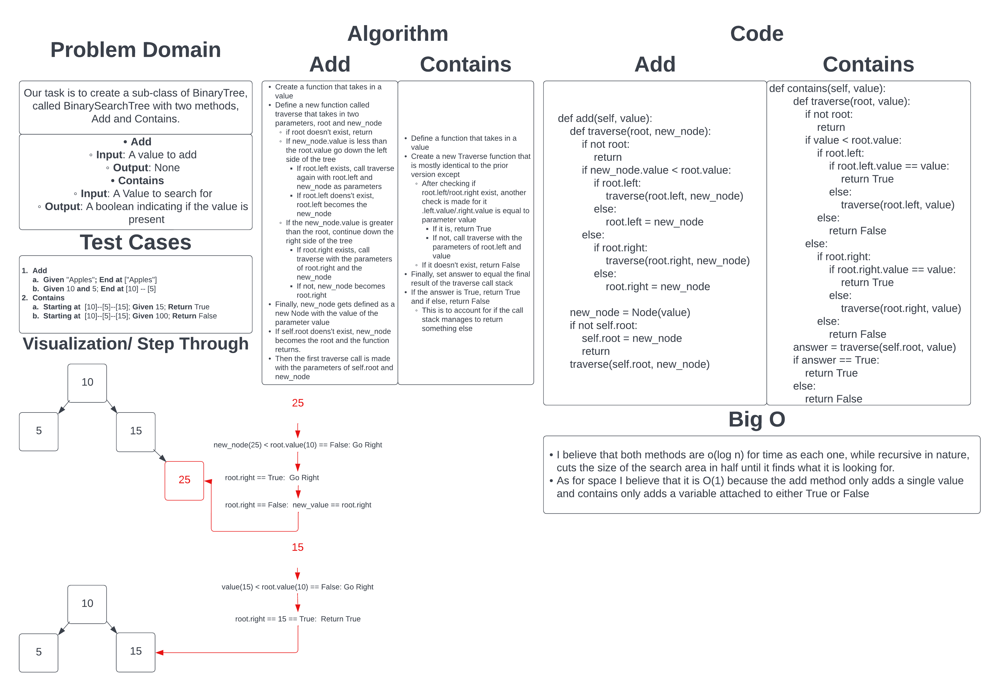

# Binary Tree and Binary Search Tree

## Challenge Summary

For the Binary Tree, our task is to create the BinaryTree class as well as the Node class. The Node class needed a value, a left child reference, and a right child reference. The Binary Tree Class needed three methods; Pre-Order, In-Order, and Post-Order. Each of which would return a list of values ordered appropriately to the method.

## Whiteboard Process

## Approach & Efficiency

I took the approach of having a recursive function and appending the value to an external list with the order of the appending and recursive call being the order of the method.
I believe that Big O for this approach is O(n) for time and space as it goes through the entire tree and thus the larger the tree, the longer it will take and the larger the output list; and despite the size of each level of the tree being a maximum of double the previous, I believe it is still a proportional growth and thus still O(n)

## API

- Pre-Order
  - When given a list of values, Pre-Order goes in the order of add the value, then proceed down the left side of the tree then the right side of the tree.
- In-Order
  - When given a list of values, In-Order goes in the order of going down the left side of the tree, appending the value, then down the right side of the tree.
- Post-Order
  - When given a list of values, Post-Order goes in the order of going down the left side of the tree, then the right side of the tree, then appending the value.

[Link to Binary Tree Code](../../data_structures/binary_tree.py)

---

## Challenge Summary

For the Binary Search Tree, our task is to create a sub-class of BinaryTree called BinarySearchTree that has two methods; Add and Contains. The add method needs a value to be added and returns None. The Contains method needs a value to search for and returns a Boolean representative of if the value is in the tree.

## Whiteboard Process

## Approach & Efficiency

I took the approach of having a recursive function and conditional checks that halve the search area for either function. For add, it is searching for the correct place for a new value and for Contains it is searching for a specified value.

I believe this approach, despite being recursive in nature would be O(log n) for time as it still halves the search area each time.
As for space, I belive it is O(1) as the values it stores remain the same regardless of the size of the tree.

## API

- Add
  - When given a value, it will add the value where appropriate on the Tree, if it's greater than the root, it goes on the right side, and if lesser, the left. It will continue down the tree until it encounters an empty spot in the appropriate position.
- Contains
  - When given a value, it will traverse through the tree, searching for the value provideed. Given that is is a Binary Search Tree, it does this by comparing each value against the provided value and proceeding in the correct direction according to the result of the comparison

[Link to Binary Search Tree Code](../../data_structures/binary_search_tree.py)
